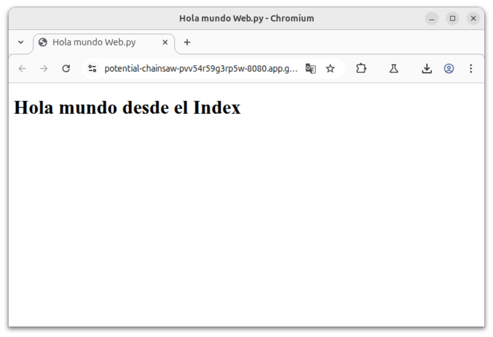
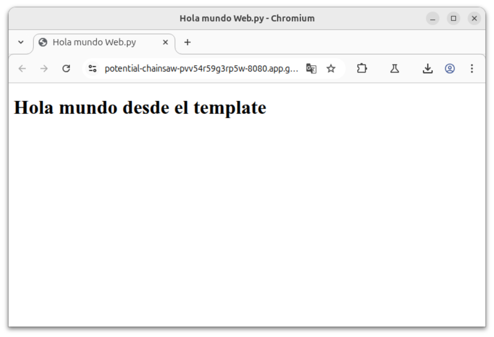

# 5. Templates html y datos (valores predeterminados)

## 1. Ejemplo de templates y datos (valores predeterminados)

En el siguiente código se muestra un ejemplo de como realizar el renderizado de un archivo **html** que recibe parámetros.

1. Enviando valores.
2. Sin enviar valores.

```python
import web

urls = (
    '/', 'Index'
)
render = web.template.render('templates')
app = web.application(urls, globals())

class Index:
    def __init__(self):
        self.message = "Hola mundo desde el Index"

    def GET(self):
        #return render.index(self.message)
        return render.index()

if __name__ == "__main__":
    app.run()
```

## 2. Página index.html que recibe datos

Está página es una extensión del ejemplo anterior, como primer línea se utiliza **$def with(data="Hola mundo desde el template.py")** lo que permite recibir cualquier tipo de objeto enviado desde **python** con **web.py**, tambien se realiza la inicialización de las variables, que si no reciben valores tomaria un valor predeterminado.

**NOTA**: El objeto **data** puede tener cualquier nombre.

```html
$def with(data="Hola mundo desde el template.py")
<!DOCTYPE html>
<html lang="es">
    <head>
        <meta charset="utf-8">
        <meta name="viewport" content="width=device-width, initial-scale=1">
        <title>Hola mundo Web.py</title>
    </head>
    <body>
        <h1>$data</h1>
    </body>
</html>
```

## 3. Renderizado de los datos recibidos

Los datos se reciben mediante **$def with(data)**.

Se utiliza el simbolo **$** acompañado de la variable **data** para renderizar el valor de esta variable.


**NOTA**: En lugar de mostrar **$data** se mostrará el valor de la variable.

```html
<h1>$data</h1>
```

## 4. Renderizado de index.html enviando datos

Al igual que en ejemplo anterior se renderiza la página **index.html**, en este caso dentro de los parentesís **(self.message)** se esta enviando al archivo un **objeto** de tipo **str**.

**NOTA**: Tomando la base de la programación orientada a objetos en la que todo es un **objeto** se prodrá enviar cualquier tipo de datos **str**, **int**, **bool**, **float**, **dict**, **list**, etc.


### 4.1 Renderizado con valores

En este ejemplo se muestra el renderizado enviando una variable.

```python
return render.index(self.message)
```

En la **Imagen 1** se muestra la aplicación desplegada mostrando el mensaje enviado desde el index.



Imagen 1: Captura de pantalla de la app en ejecución.


### 4.2 Renderizado sin valores

En este ejemplo se muestra el renderizado sin enviar valores, esto hará que el archivo **html** le asigne un valor prederminado a la variable.

```python
return render.index()
```

En la **Imagen 2** se muestra la aplicación desplegada mostrando el mensaje predefinido desde el template index.html.



Imagen 2: Captura de pantalla de la app en ejecución.