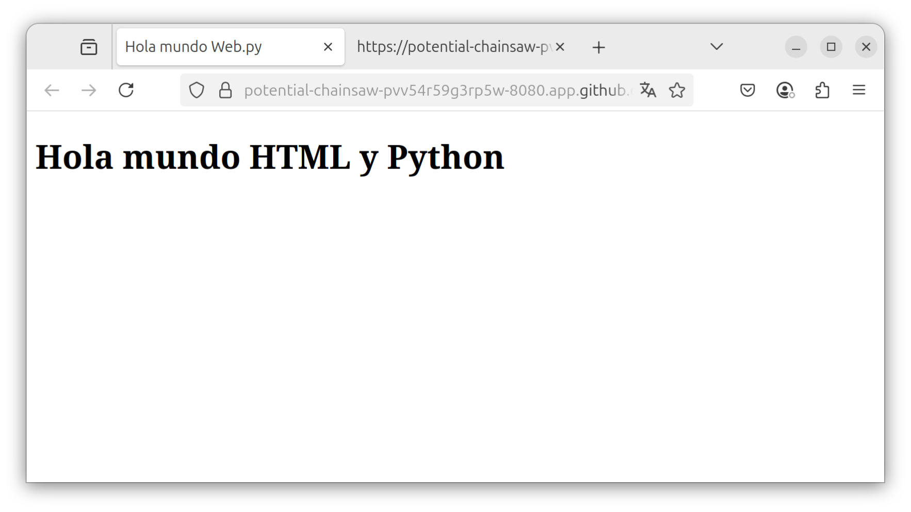
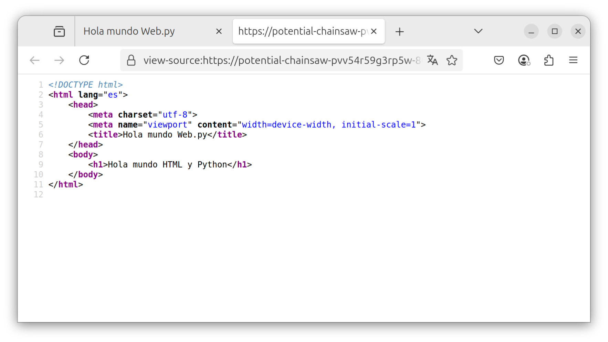

# 2. Templates

## 1. Ejemplo de templates

El siguiente código muestra el uso de templates **HTML** [web.py Templator](https://webpy.org/docs/0.3/templetor).

En el ejemplo anterior la clase **Index** respondia a las solicitudes del método **GET** con un texto, en este ejemplo la respuesta será el **renderizado** de un archivo **HTML**.

````python
import web

urls = (
    '/', 'Index'
)

render = web.template.render('templates')

app = web.application(urls, globals())

class Index:
    def GET(self):
        return render.index()

if __name__ == "__main__":
    app.run()
````


## 2. Configuración de los Templates

Para utilizar archivos **HTML** como respuesta a las peticiones se creará un objeto de tipo **web.template.render**, esto permitirá definir una **carpeta** en la que se almacenarán los archivos **HTML** y desdé donde se llamarán para ser renderizadas.

NOTA: En este ejemplo se usará la carpeta **templates** la cuál puede tener cualquier nombre, siempre y cuando **coincida** con una carpeta creada en la carpeta del proyecto.


````python
render = web.template.render('templates')
````

## 3. Página index.html 

Cómo ejemplo se utiliza un archivo de nombre **index.html** el cuál se guarda en la carpeta **templates**, este ejemplo se tomó del ejemplo de [boostrap](https://getbootstrap.com/docs/5.3/getting-started/introduction/)

````html
<!DOCTYPE html>
<html lang="es">
    <head>
        <meta charset="utf-8">
        <meta name="viewport" content="width=device-width, initial-scale=1">
        <title>Hola mundo Web.py</title>
    </head>
    <body>
        <h1>Hola mundo HTML y Python</h1>
    </body>
</html>
````

## 4. Renderizado de index.html

Cuando se accede a la ruta **/** se llama a la clase **Index** y se invoca al método **GET**, y este responde renderizando el archivo **index.html**.

NOTA: **index()** corresponde al archivo **index.html**, si el archivo tuviera el nombre **bienvenida.html** entonces se invocaría usando **bienvenida()**. 

````python
return render.index()
````

En la Imgagen 1 se muestra la aplicación desplegada.



Imagen1: Captura de pantalla de la app en ejecución.

En la Imagen 2 se muestra el **source code** de la página desplegada, y cómo se puede apreciar es el archivo **html** renderizado.



Imagen2: Captura de pantalla del codigo fuente del html.