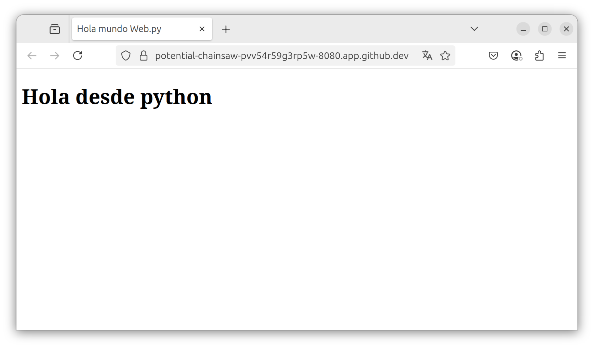
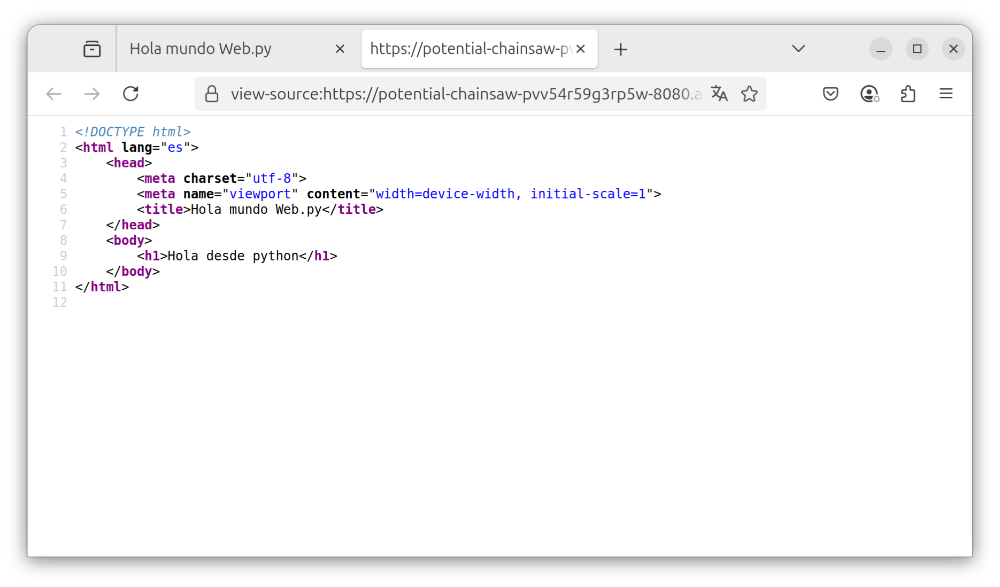

# 3. Templates html y datos

## 1. Ejemplo de templates y datos

El siguiente código muestra el uso de templates **HTML** y datos enviados a los archivos desde python [web.py Templator](https://webpy.org/docs/0.3/templetor).

En el ejemplo anterior la clase **Index** respondia a las solicitudes del método **GET** mediante el  **renderizado** de un archivo **HTML**.

````python
import web

urls = (
    '/', 'Index'
)
render = web.template.render('templates')
app = web.application(urls, globals())

class Index:
    def __init__(self):
        self.message = "Hola desde python"

    def GET(self):
        return render.index(self.message)

if __name__ == "__main__":
    app.run()
````

## 2. Página index.html que recibe datos

Está página es una extensión del ejemplo anterior, como primer línea se utiliza **$def with(data)** lo que permite recibir cualquier tipo de objeto enviado desde **python** con **web.py**.

**NOTA**: El objeto **data** puede tener cualquier nombre.

````html
$def with(data)
<!DOCTYPE html>
<html lang="es">
    <head>
        <meta charset="utf-8">
        <meta name="viewport" content="width=device-width, initial-scale=1">
        <title>Hola mundo Web.py</title>
    </head>
    <body>
        <h1>$data</h1>
    </body>
</html>
````

## 3. Renderizado de los datos recibidos

Los datos se reciben mediante **$def with(data)**.

Se utiliza el simbolo **$** acompañado de la variable **data** para renderizar el valor de esta variable.


**NOTA**: En lugar de mostrar **$data** se mostrará el valor de la variable.

````html
<h1>$data</h1>
````

## 4. Renderizado de index.html enviando datos

Al igual que en ejemplo anterior se renderiza la página **index.html**, en este caso dentro de los parentesís **(self.message)** se esta enviando al archivo un **objeto** de tipo **str**.

**NOTA**: Tomando la base de la programación orientada a objetos en la que todo es un **objeto** se prodrá enviar cualquier tipo de datos **str**, **int**, **bool**, **float**, **dict**, **list**, etc.

````python
return render.index(self.message)
````

En la Imgagen 1 se muestra la aplicación desplegada.



Imagen1: Captura de pantalla de la app en ejecución.

En la Imagen 2 se muestra el **source code** de la página desplegada, y cómo se puede apreciar es el archivo **html** renderizado incluyendo el valor de **$data**:**"Hola desde python"**.



Imagen2: Captura de pantalla del codigo fuente del html.