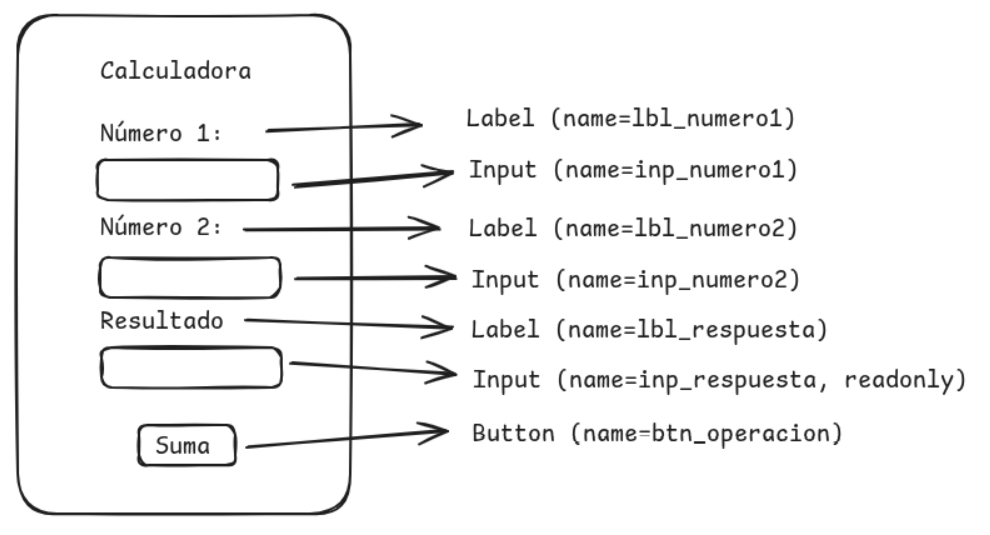

# 6. Formularios (calculadora)

## 1. Ejemplo de formularios

En el siguiente código se muestra el uso de formularios mediante el método POST

```python
import web

urls = (
    '/', 'Calculadora',
)
render = web.template.render('templates')
app = web.application(urls, globals())

class Calculadora:

    def __init__(self):
        pass

    def GET(self):
        return render.calculadora()
    
    def POST(self):
        formulario = web.input()
        print(formulario)
        try:
            numero1 = int(formulario.inp_numero1)
            numero2 = int(formulario.inp_numero2)
            
            resultado = numero1 + numero2
            
            return render.calculadora(resultado)
        except Exception as e:
            return render.calculadora()

if __name__ == "__main__":
    app.run()
```

## 2. Página calculadora.html

En la **Imagen 1** se muestra la propuesta de diseño de la aplicación calculadora.



Imagen 1: Captura de pantalla de la app en ejecución.

### 2.1 Maquetado

Una vez realizado el diseño se realiza el maquetado utilizando **HTML**, tal como se muestra en el siguiente ejemplo.


```html
$def with(resultado=0)
<!DOCTYPE html>
<html lang="es">
    <head>
        <meta charset="utf-8">
        <meta name="viewport" content="width=device-width, initial-scale=1">
        <title>Calculadora</title>
    </head>
    <body>
        <h1>Calculadora en web.py</h1>

        <form method="POST">

            <label for="inp_numero1">Número 1:</label><br>
            <input type="number" name="inp_numero1" id="inp_numero1" required value=0><br>

            <label for="inp_numero2">Número 2:</label><br>
            <input type="number" name="inp_numero2" id="inp_numero2" required value=0><br>

            <label for="inp_resultado">Resultado:</label><br>
            <input type="number" name="inp_resultado" id="inp_resultado" readonly value=$resultado><br>
            
            <button type="submit" name="btn_operacion" value="suma">Calcular</button>

        </form>

    </body>
</html>
```

### 2.2 Método de envío de datos

Para el envío de datos del **Front-emd** en html al **Back-end** desarrollado en python se utiliza un formulario **form**, para este caso se utiliza el atributo **method** indicando el método de envio de los datos, en este caso **POST**.

Nota: En el caso de **web.py** no es necesario indicar el atributo **action** ya que los datos se enviarán a la clase que renderizo el archivo **calculadora.html**.

```html
<form method="POST">
```

### 2.3 Formulario

Para el envío de los datos se utilizarán **input** de tipo numérico, para poder recibir los datos es necesario que a los input se les asigne valor al atributo **name**, y tambien se agrega el atributo **id** en caso de que se requira utilizar alguna validación de datos utiliando **javascript**.

```html
<label for="inp_numero1">Número 1:</label><br>
<input type="number" name="inp_numero1" id="inp_numero1" required value=0><br>
```

### 2.4 Valores predeterminados

En este caso se tiene una variable **resultado** con un valor inicial de **0** en caso de que no se reciba un valor. 


```html
$def with(resultado=0)
```

Cuando se reciba el resultado de la suma este valor se mostrará en el **input** **inp_resultado**, tal cómo se muestra a continuación.

**Nota**: Este **input** será de sólo lectura para envitar que se modifique el valor.

```html
<input type="number" name="inp_resultado" id="inp_resultado" readonly value=$resultado><br>
```

### 2.5 Envío de los datos

Para el enviar los datos de los **input** se utilizará en este ejemplo un **button** de tipo **submit**.

```html
<button type="submit" name="btn_operacion" value="suma">Calcular</button>
```

